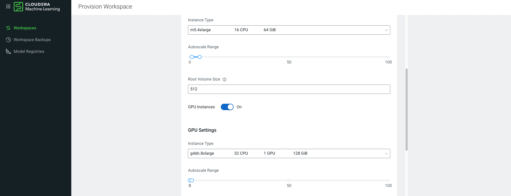
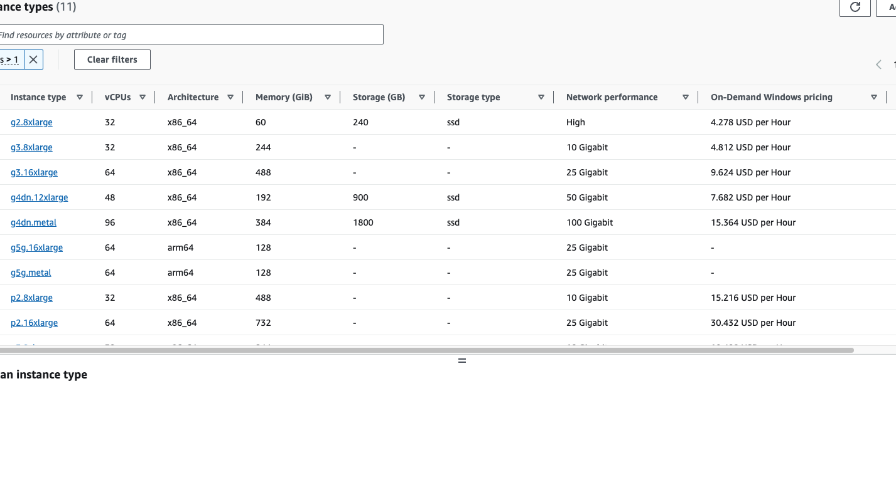
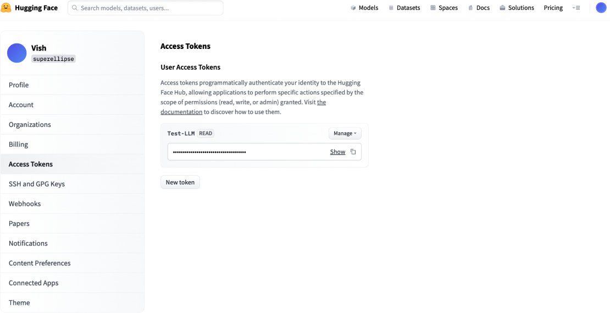

#  GenAI CML Workshop / Hands-on-Lab

## Table of Contents

### [1 Objective](#1-Objective)
### [2 Getting Started](#2-getting-started)
#### &nbsp;&nbsp;&nbsp;&nbsp;[2.1 Setting up a CML Workspace for GPU](#21-setting-up-a-cml-workspace-for-gpu)

### [3 The Lab Exercises](#3-the-lab-exercises)  
#### &nbsp;&nbsp;&nbsp;&nbsp;[3.1 Accessing Language Models and Datasets](#31-accessing-large-language-models-and-datasets)
#### &nbsp;&nbsp;&nbsp;&nbsp;[3.2 Setting up Libraries](#32-setting-up-libraries)
#### &nbsp;&nbsp;&nbsp;&nbsp;[3.3 Exercises on using LLMs on CML ](#33-exercises-on-using-llms-on-cml)

## 1 Objective
The purpose of this Workshop is to enable existing or prospective customers to experience how they can use Cloudera Machine Learning(CML) for developing Generative AI Applications. 
This workshop will focus on th uses cases around using Large Language Models popularly abbreviated as LLMs.CML offers prototypes called as AMPs ( Applied Machine Learning Prototypes) 
that can be used to quickly spinoff LLL Applications. Please refer to references for more details on this topic
 
## 2 Getting Started
Most LLM Models will employ some GPU compute and hence it is essential that at this point you have access to GPU Hardware. 
If you are on CML Public cloud the best way to get started is to provision a new Workspace and set it up to include a GPU. For almost  
all the exercises here i use the basic V100 GPU. Here i use mostly Amazon Web Services (AWS) to set up necessary compute but it really is not necessary to use AWS. You can set up any other Hyperscaler to work with CML as well. Refer to CML Public cloud documentation on the web if necessary.

### 2.1 Setting up a CML Workspace for GPU
In order to work with GPUs your CML Workspace must be provisioned with GPU Compute and you will be needing to also use GPU runtimes. Couple of things may trip you up when you are trying to provision GPU infrastructure : 
- The Cloud Provider may not have a GPU instance in the region that you are requesting the GPU. In this case you need to check the GPU availablity for that region. The best way to do that in case of AWS is to login to your AWS Account and check the available GPUs for the region in which you are creating the Workspace. Refer to the following  
&nbsp;
 
 &nbsp;
 
 &nbsp;

### Important Note
  Make sure that you are either using a GPU provisioned workspace or are able to create a workspace with the GPU instance successfully before proceeding further with this workshop/ demo**

## 3 The Lab Exercises
### 3.1  Accessing Large Language Models and Datasets
In all the exercises we will be accessing Huggingface hub as a source for the models. In order to do this it is a good idea to create an account on hugging face because in some cases hugging face may require a user access token to access Hugging face. Here are some somethings to do : 
1. Create a new account on Hugging face if you do not have one. If you are a cloudera employee you can also use a corporate account ( cloudera account to login to Hugging face now)
2. Setup an Access token on Hugging Face

### 3.2 Setting up libraries
To get started please execute the bootstrap.py on a terminal to set up the libraries required for you to get starated

## 3.3 Exercises on using LLMs on CML
---
Clicking on each leads you to a folder with a notebook and/or code artefacts folder
1. **[Prompting LLMs](001_prompting-llms) :** Downloading and Prompting a pretrained LLM from Hugging on CML. 
2. **[Advanced Prompting](002_advanced-prompting) :** Work with a pretrained model to set up advanced prompting using Langchain Framework
3. **[Instruction Tuning with Lang Chain](003_instruction-tuning-with-langchain) :** Work with Langchain framework for Instruction Tuning and Context Augmentation
4. **[Deploying Models in CML using CML API](004_deploy-and-test-models)** : Use CML API to deploy a model as an API Endpoint and test the model in a command line or jupyter notebook
5. **[Finetuning to Finance Domain](005_finetuning-to-finance-domain)e** : Use a custom Dataset to demonstrate fine tuning using LoRA adapters on a financial Dataset
6. **Measuring Model Preformance( UNDER DEVELOPMENT)**  : Benchmark a pre-trained model and compare the model performance against the finetuned model in step 5. 
7. **Developing and Deploying User Applications( UNDER DEVELOPMENT)**: 
Use Gradio to build and deploy AI applications 
8. **Distributing Fine-tuning Workloads on GPU( UNDER DEVELOPMENT)** : Distributing the finetuning workloads with DASK on CML 